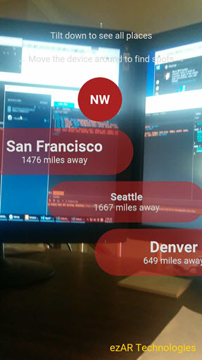

# ezar-cities
Display cards with city direction and location on a google map view or overlaying an augmented reality view. 
The AR view and the screenshot feature are provided by the ezAR VideoOverlay and Screenshot plugins respectively.

This demo is an updated working version of index_UScities.html, part of the XDK [html5-augmented-reality-app project](
https://github.com/krisrak/html5-augmented-reality-app). XDK deprecated its augmented reality features.

Modifications to the original project:  
* Configured the AR UI to use transparent background and semi-transparent city distance markers
* Added ezAR VideoOverlay and Snapshot plugins
* Added snapshot button and onclick action to use the snapshot plugin feature
* Added ezAR attribution text

##ezAR Docs and Tech Support
See [ezartech.com](http://ezartech.com) for documentation and support.